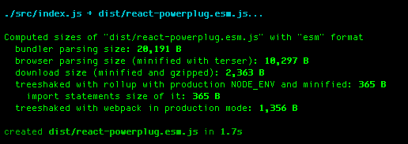

# rollup-plugin-size-snapshot [![Build Status][travis-img]][travis]

[travis-img]: https://travis-ci.org/TrySound/rollup-plugin-size-snapshot.svg
[travis]: https://travis-ci.org/TrySound/rollup-plugin-size-snapshot



This plugin provides details about

- actual bundle size (bundler parsing size)
- minified bundle size (browser parsing size)
- gzipped bundle size (download size)

All of these sizes are important criteria when choosing a library, and they will be stored in the `.size-snapshot.json` file.

There is also a nice feature for the `es` output format which provides sizes of treeshaked bundles with both rollup and webpack, so if your library has more than one independent parts, you can track that users will not consume dead code. Such bundles entry point looks like this

```js
// nothing is imported here so nothing should go in user bundle
import {} from "library";
```

## Why bundle with rollup

- internals are hidden so you shouldn't worry that user reuses your frequently updated modules
- faster user bundling if library has a lot of modules
- predictable and more efficient scope hoisting and as a result more predictable size
- easier to work without sourcemaps with vendors since development bundlers add a lot of unreadable stuff in module definition

## Usage

```js
import { sizeSnapshot } from "rollup-plugin-size-snapshot";

export default {
  input: "src/index.js",
  output: {
    file: "dist/index.js",
    format: "es",
  },
  plugins: [sizeSnapshot()],
};
```

If you use uglify or terser plugins, then make sure they are placed after this one.

```js
import { uglify } from "rollup-plugin-uglify";
// or import { terser } from "rollup-plugin-terser";
import { sizeSnapshot } from "rollup-plugin-size-snapshot";

export default {
  // ...
  plugins: [sizeSnapshot(), uglify({ toplevel: true })],
};
```

## Options

### snapshotPath

type: `string`  
default: `'.size-snapshot.json'`

### matchSnapshot

This option allows you to verify that contributors don't forget to build or commit the `.size-snapshot.json` file. If this is `true`, the plugin will validate the snapshot against an existing one. Typically, one would define this option's value as true during continuous integration; [using it locally is unintended](https://github.com/TrySound/rollup-plugin-size-snapshot/issues/33).

type: `boolean`  
default: `false`

### threshold

Possible difference between sizes in actual snapshot and generated one.

Note: Make sense only when `matchSnapshot` is `true`.

type: `number`  
default: `0`

### printInfo

Allows you to disable log to terminal.

type: `boolean`  
default: `true`

# License

MIT &copy; [Bogdan Chadkin](mailto:trysound@yandex.ru)
